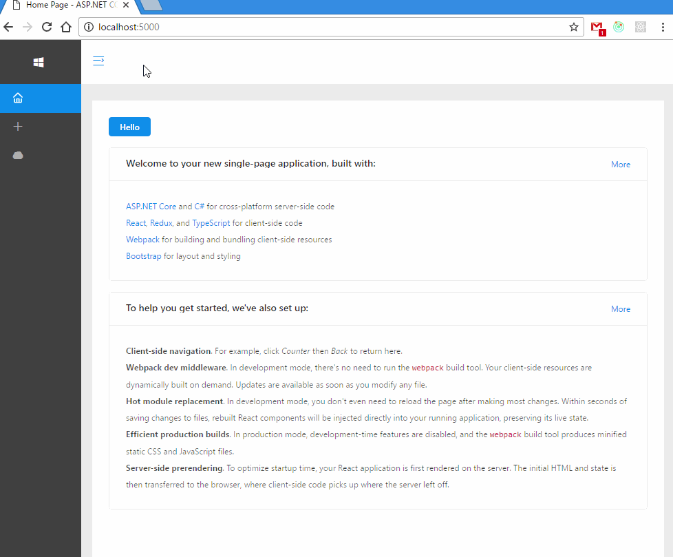

# aspnet-core-react-antd-boilerplate
> Server Side Rendering antd with ASP.NET CORE [Asp.net core JavaScriptServices](https://github.com/aspnet/JavaScriptServices). read more info from [here](https://github.com/aspnet/JavaScriptServices/tree/dev/src/Microsoft.AspNetCore.SpaServices#server-side-prerendering) 

**NOTE**: this is a WIP project. now it works, will make it better later.

## install

You need install <https://www.asp.net/core> before start.

and make sure yarn is installed.
 

Then clone this boilerplate to your local disk

```sh

git clone git@github.com:bang88/aspnet-core-react-antd-boilerplate.git

# dotnet restore deps

dotnet restore

```

start a local server

```sh
# set env

# - bash
# ASPNETCORE_ENVIRONMENT=Development dotnet run 

# - windows
# set ASPNETCORE_ENVIRONMENT="Development"

dotnet run

```

If no errors. you can open your browser at: <http://localhost:5000/> view the webpage.

